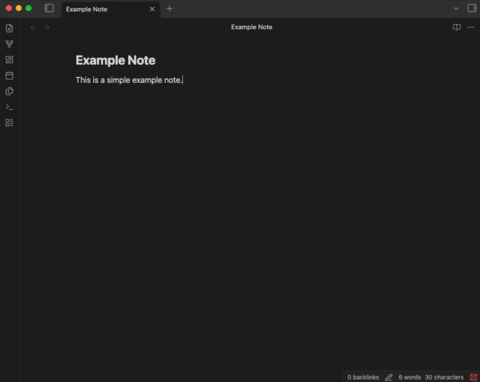

# AI Notes - Obsidian Plugin


An Obsidian plugin to record audio, transcribe it, and enrich your written notes with AI-powered insights.



## Features

- 🎙️ **Audio recording** — Record directly from your microphone while editing a note
- ✍️ **Transcription** — Convert recordings to text using [whisper.cpp](https://github.com/ggerganov/whisper.cpp) or any OpenAI-compatible endpoint
- 🤖 **AI enrichment** — Combine your notes and transcriptions, then summarize and structure them with an LLM
- 📂 **Organized storage** — Recordings are saved in per-note folders inside a configurable vault directory
- 🔌 **Flexible backends** — Works with local models ([Ollama](https://github.com/ollama/ollama), whisper.cpp, [llama.cpp](https://github.com/ggml-org/llama.cpp)) or cloud APIs (OpenAI, etc.)

## Commands

| Command | Description |
|---|---|
| `Start/Stop recording` | Toggle microphone recording — audio is embedded in the active note |
| `Transcribe recordings` | Transcribe all embedded audio files in the current note |
| `Enrich note` | Generate an AI-powered summary combining your notes and transcriptions |

All commands are available via the Obsidian command palette (<kbd>Ctrl</kbd>/<kbd>Cmd</kbd> + <kbd>P</kbd>).

## Installation

1. Open **Settings** → **Community Plugins** → **Browse**
2. Search for **AI Notes**
3. Click **Install**, then **Enable**

### Manual installation

1. Download the latest release from [GitHub Releases](https://github.com/derogab/obsidian-plugin-ai-notes/releases)
2. Extract `main.js`, `manifest.json`, and `styles.css` into your vault at `.obsidian/plugins/ai-notes/`
3. Reload Obsidian and enable the plugin in **Settings** → **Community Plugins**

## Configuration

Open **Settings** → **AI Notes** to configure the plugin.

### Recording

| Setting | Description | Default |
|---|---|---|
| `Recordings folder` | Vault folder where audio files are saved | `recordings` |

### Transcription (Whisper)

| Setting | Description | Default |
|---|---|---|
| `Whisper endpoint URL` | whisper.cpp server (`http://host:port`) or OpenAI-compatible (`http://host:port/v1`) | `http://localhost:8080` |
| `Whisper model` | Model name (only for OpenAI-compatible endpoints) | `whisper-1` |
| `Whisper API key` | Optional API key (only for OpenAI-compatible endpoints) | — |

### Enrichment (LLM)

| Setting | Description | Default |
|---|---|---|
| `LLM endpoint URL` | OpenAI-compatible API base URL | `http://localhost:11434/v1` |
| `LLM API key` | Optional API key for the endpoint | — |
| `LLM model` | Model name to use for enrichment | `llama3` |

## Usage

### 1. Record

Open a note and run **Start/Stop recording** from the command palette. The status bar shows 🔴 while recording. Run the command again to stop — the audio file is automatically embedded in your note.

### 2. Transcribe

Run **Transcribe recordings** to convert all embedded audio files in the current note to text. Transcriptions appear in collapsible blocks below each recording.

### 3. Enrich

Run **Enrich note** to send your written notes and transcriptions to an LLM. The AI-generated summary is appended to your note.

### Note structure

The plugin organizes your note like this:

```markdown
Your written notes here...

## 🔴 REC
![[recording-file.webm]]
<details>
<summary>Transcription</summary>
Transcribed text...
</details>

## 🤖 AI
AI-generated enrichment...
```

## Credits

_AI Notes_ is made with ♥ by [derogab](https://github.com/derogab).

### Contributors

<a href="https://github.com/derogab/ai-notes/graphs/contributors">
  
</a>

### Tip
If you like this project or directly benefit from it, please consider buying me a coffee:  
🔗 `bc1qd0qatgz8h62uvnr74utwncc6j5ckfz2v2g4lef`  
⚡️ `derogab@sats.mobi`  
💶 [Sponsor on GitHub](https://github.com/sponsors/derogab)

### Stargazers over time
[](https://starchart.cc/derogab/ai-notes)
